# Portafolio de QA Engineering — Salvador Flores Vélez

Proyectos realizados durante el Bootcamp de QA Engineering (TripleTen LatAm, 2026)

## Proyectos

### Sprint 1 — Pruebas de regresión manuales
**Objetivo:** ejecutar un set de casos de prueba sobre la interfaz de Urban Routes
(mapa, campos de dirección, modos de vista) y reportar los bugs encontrados.

**Resultado:** 24 casos de prueba ejecutados, 8 bugs detectados y documentados
(severidad, pasos de reproducción, resultado esperado vs. actual).

**Habilidades:** diseño y ejecución de casos de prueba, reporte de bugs, documentación QA.

🔗 [Ver casos de prueba y reporte de bugs](https://docs.google.com/spreadsheets/d/1hOTAiXhxT9r9PKDr_Sm2K23A-KJ_3AhW/edit?usp=sharing&ouid=105054465225390802960&rtpof=true&sd=true)

---

### Sprint 2 — Diseño de pruebas
**Objetivo:** analizar los requisitos de la función "compartir un automóvil" de Urban Routes
y diseñar pruebas a partir de ellos: mapa mental de la interfaz, clases de equivalencia
y valores límite, diagrama de flujo de la lógica de velocidad, y casos de prueba para el
cálculo de precio y duración del viaje.

**Resultado:** mapa mental (draw.io) del campo "Agregar licencia de conducir", clases de
equivalencia y valores límite para campos de entrada, diagrama de flujo de selección de
velocidad, y casos de prueba basados en las clases definidas.

**Habilidades:** análisis de requisitos, diseño de pruebas (clases de equivalencia,
valores límite), diagramas de flujo, documentación técnica.

🔗 [Ver documento completo](https://docs.google.com/document/d/1EL1PheutF1XanF6IJcZQyZmIFeZDx-7W/edit?usp=sharing&ouid=105054465225390802960&rtpof=true&sd=true)

---
### Sprint 3 — Pruebas de aplicaciones web
**Objetivo:** probar la funcionalidad de "compartir un automóvil" de Urban Routes en dos
entornos distintos (Chrome 800x600 y Firefox 1920x1080), diseñando listas de comprobación
y casos de prueba a partir de los requisitos y diseños en Figma.

**Resultado:** listas de comprobación de diseño y de la ventana "Método de pago", casos
de prueba para los botones "Reservar" y "Reserva de automóvil", ejecución cross-browser,
y bugs reportados y documentados en Jira (4 tableros, uno por cada parte del proyecto).

**Habilidades:** pruebas cross-browser, diseño de casos de prueba y listas de
comprobación, gestión de bugs en Jira, análisis de requisitos y diseños (Figma).

🔗 [Ver documento completo](https://docs.google.com/spreadsheets/d/1b27CvNYup5Hso9JArwOWUSEEI6cVKzrc/edit?usp=sharing&ouid=109049656323129250882&rtpof=true&sd=true)
📸 Evidencia de bugs en Jira:

Parte 1

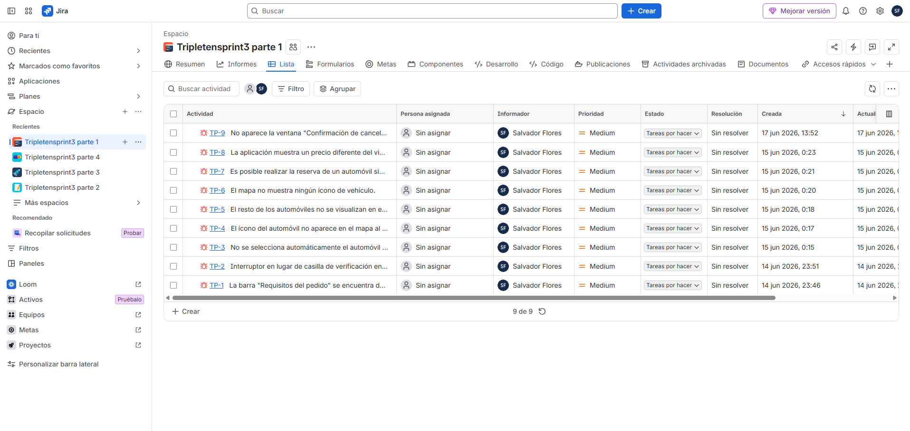
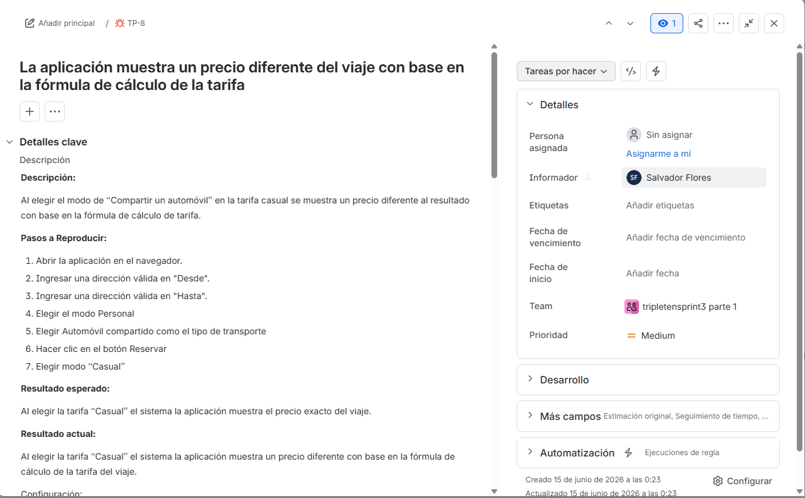
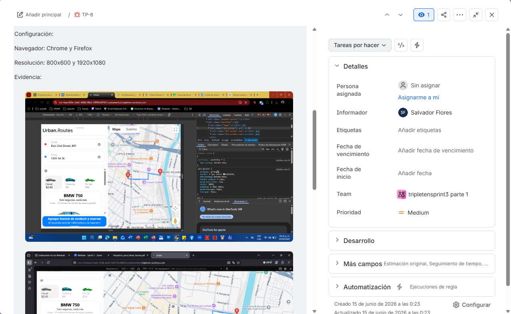
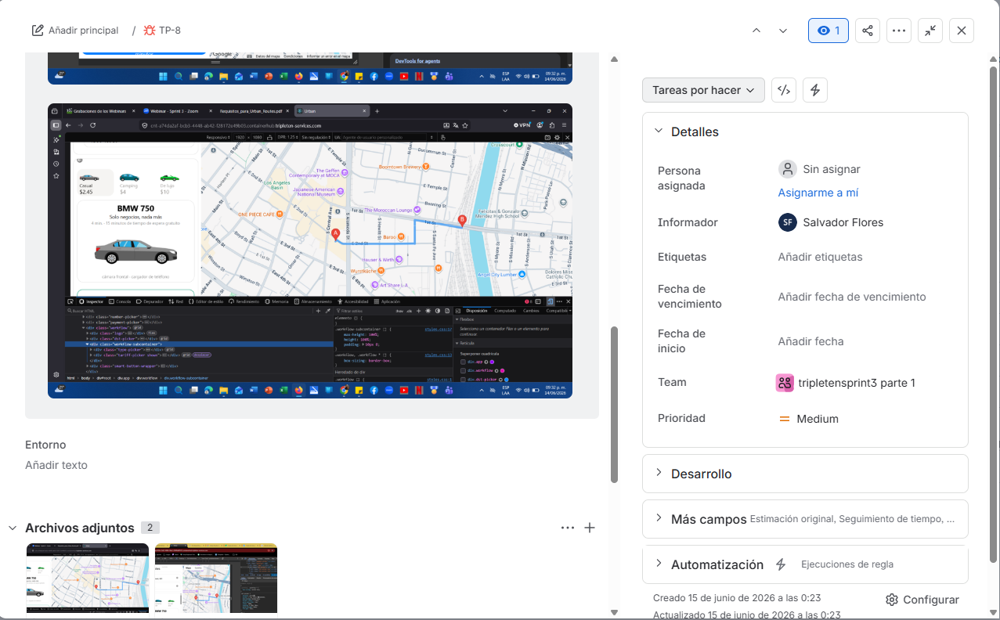

Parte 2

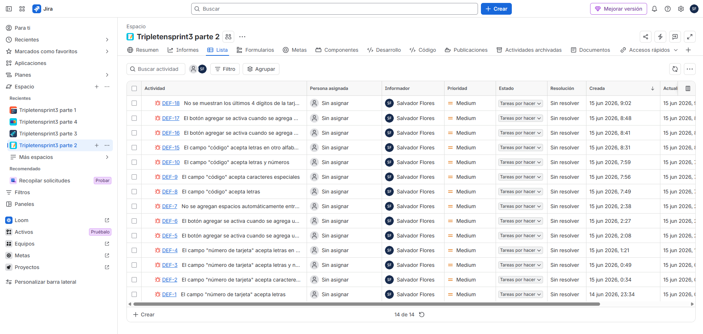
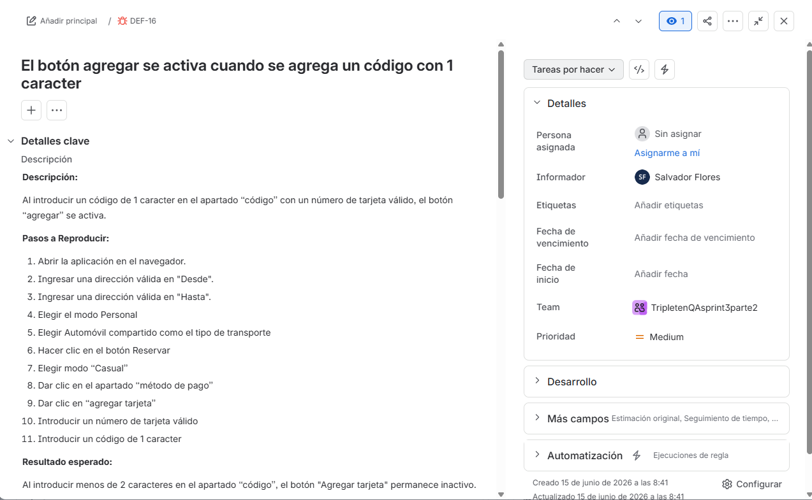
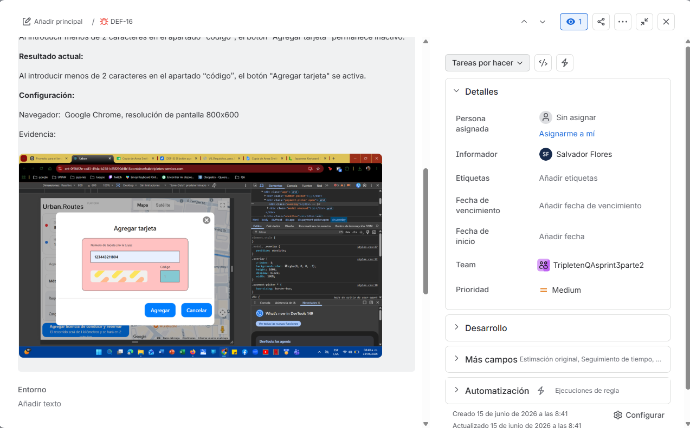

Parte 3

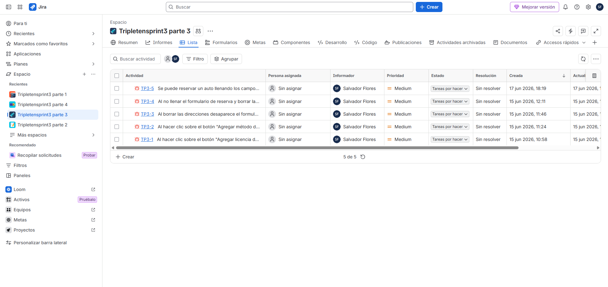
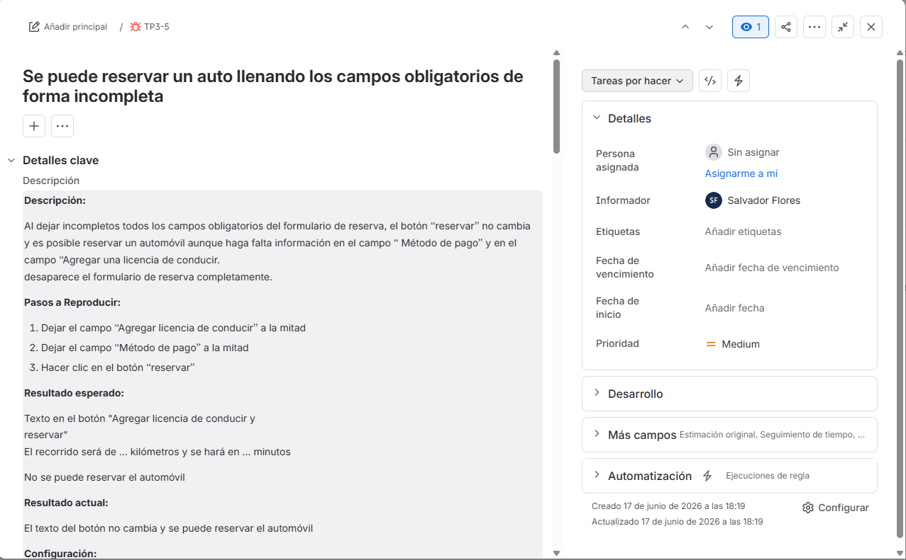
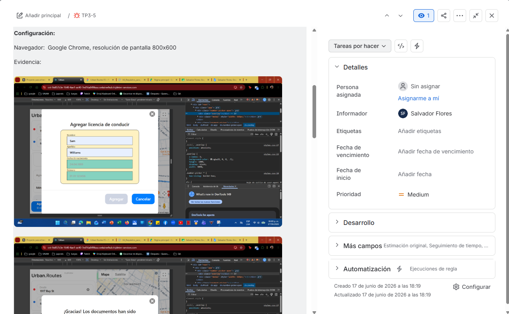
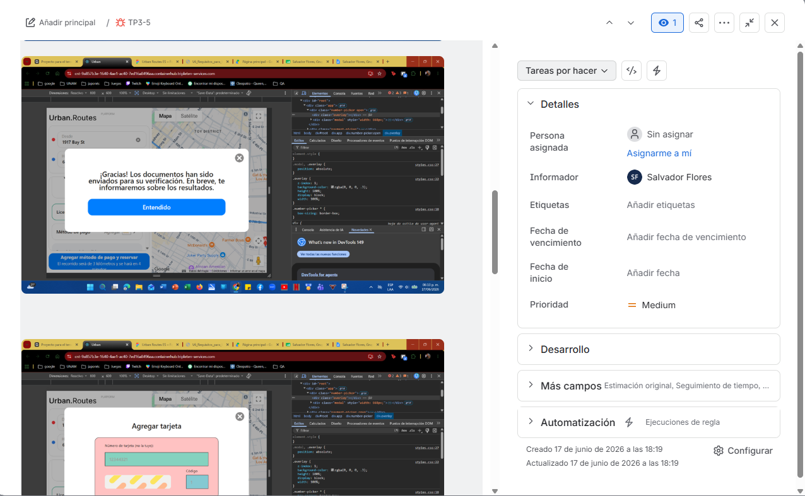
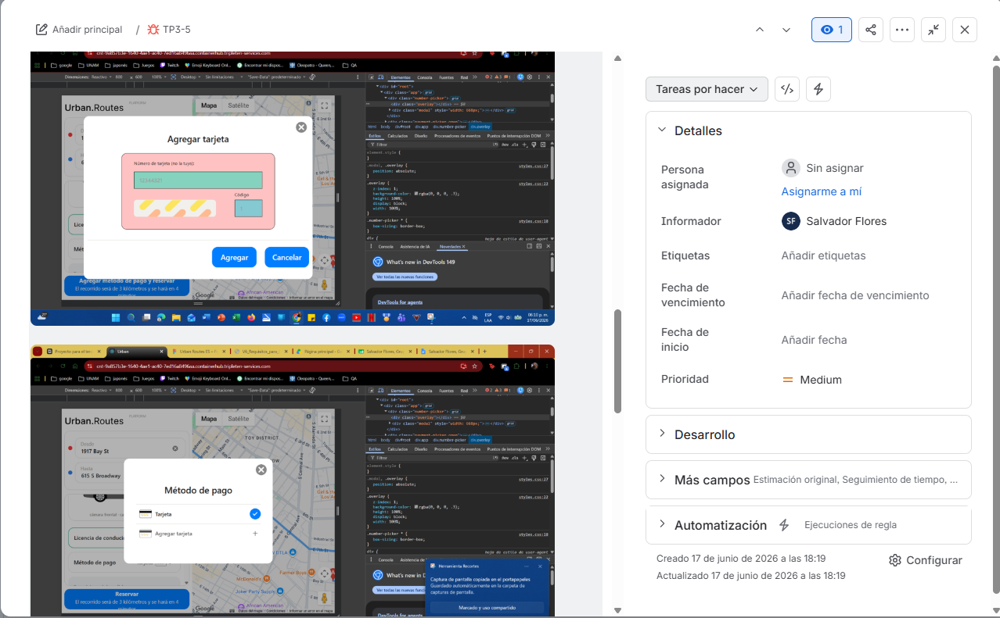
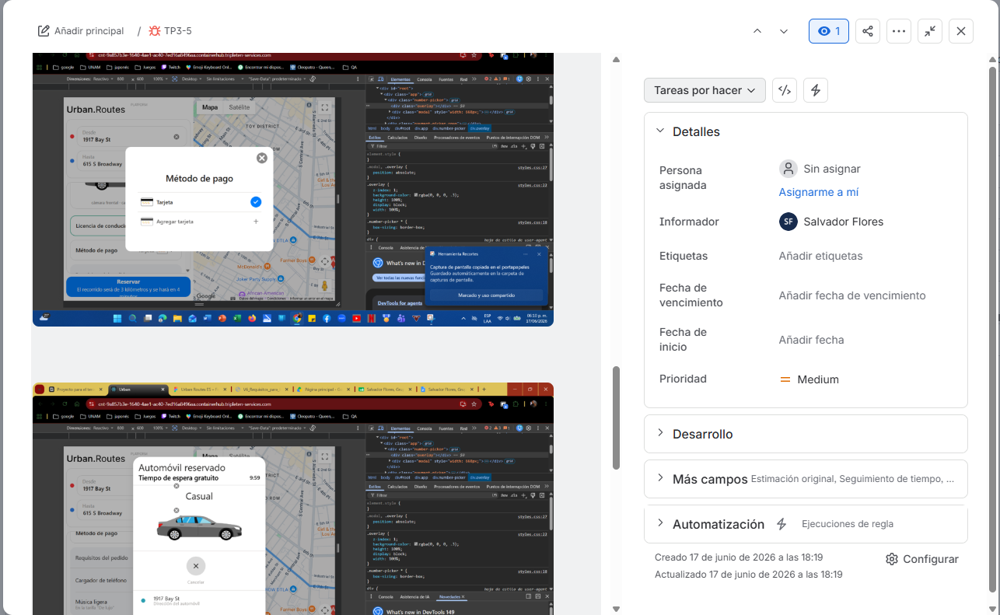
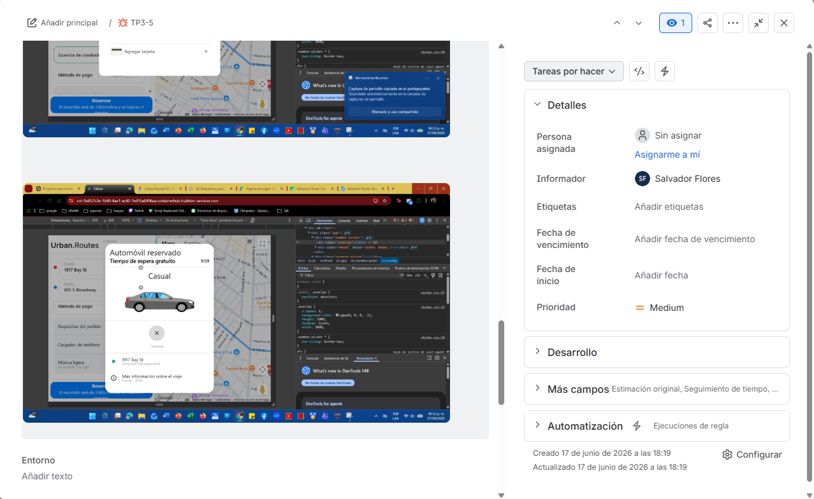

Parte 4

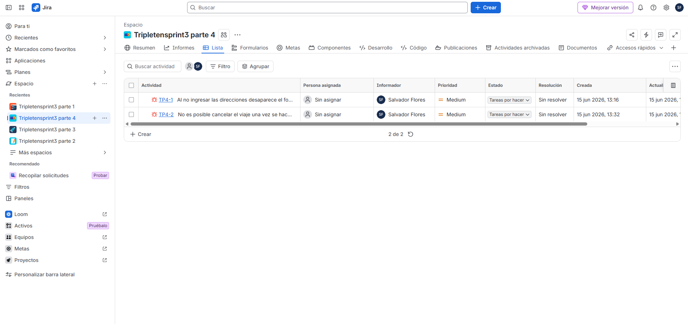
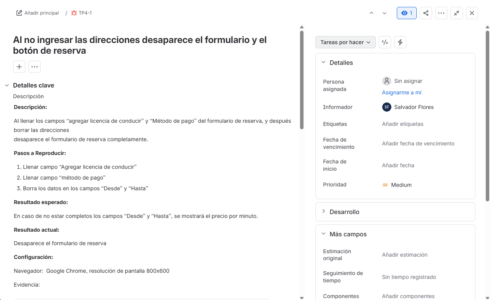
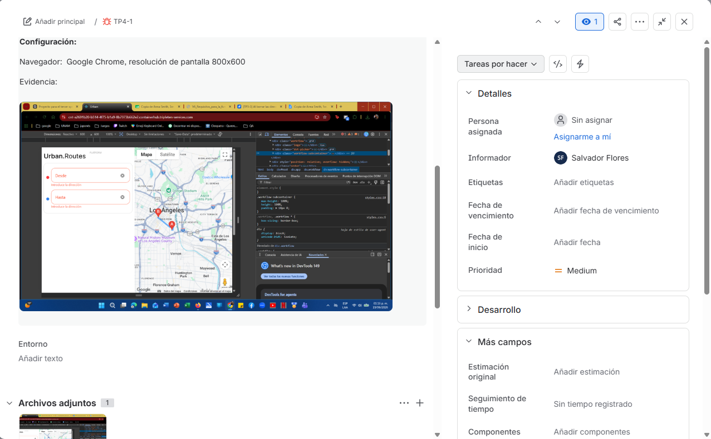

---

### Sprint 4 — Pruebas de API
**Objetivo:** analizar los requisitos del backend de Urban Grocers para dos nuevas
funciones (kits de productos y servicio de entrega "Order and Go"), diseñar casos de
prueba y ejecutarlos contra la API real usando Postman.

**Resultado:** 14-20 casos de prueba para el endpoint de kits (límite de 30 productos,
validaciones de estructura, códigos 400/404) y 15-25 casos de prueba para el endpoint
de entrega (validación de campos numéricos, clases de equivalencia y valores límite),
ejecutados en Postman con bugs documentados en Jira.

**Habilidades:** pruebas de API (Postman), análisis de documentación técnica (apiDoc),
diseño de casos de prueba (clases de equivalencia, valores límite), validación de
códigos de respuesta HTTP, gestión de bugs en Jira.

🔗 [Ver hoja de cálculo](https://docs.google.com/spreadsheets/d/10d_-O7fybP_G8prLNVH-AEQDrcLSA_zzicp8Vww9xE4/edit?usp=sharing)
**Nota:** los informes de errores de este sprint se documentaron en Jira durante el
curso, pero ya no están disponibles por la expiración de la prueba premium usada para
compartir acceso con el equipo de supervisión.
---
### Sprint 5 — Preparación de carrera
Sprint enfocado en desarrollo profesional (sin proyecto técnico entregable).

---
### Sprint 6 — Pruebas de aplicaciones móviles
**Objetivo:** probar la aplicación Android "Urban.Lunch" (pedidos de comida con
recogida en puntos físicos), diseñando una lista de comprobación a partir de los
requisitos y ejecutándola en un emulador de Android Studio.

**Resultado:** lista de comprobación para la app móvil basada en los requisitos
oficiales, pruebas ejecutadas en emulador Android, resultados marcados como
APROBADO/NO APROBADO, y bugs documentados en Jira.

**Habilidades:** pruebas de aplicaciones móviles (Android Studio), diseño de listas
de comprobación a partir de requisitos, gestión de bugs en Jira.

🔗 [Ver hoja de cálculo](https://docs.google.com/spreadsheets/d/1Hj3z2gis3CNK-setCqFEMJ5izqF2XzcQ/edit?usp=sharing)

**Nota:** los informes de errores de este sprint se documentaron en Jira durante el
curso, pero ya no están disponibles por la expiración de la prueba premium usada para
compartir acceso con el equipo de supervisión.

---
### Sprint 7 — Fundamentos de bases de datos
**Objetivo:** trabajar en consola con logs de servidor y consultar una base de datos
de viajes en taxi (Chicago) para resolver tareas de análisis e investigación de bugs.

**Resultado:**
- Consola/Linux: filtrado de logs por IP y por rango de fechas, organización de
  resultados en archivos y directorios según tipo de error (400/500).
- SQL: conteo y agrupamiento de datos (operadores HAVING, CASE), cálculo del número
  de viajes por compañía, y cruce de datos de viajes con condiciones climáticas para
  investigar un bug en el cálculo de tarifas.

**Habilidades:** comandos de consola Linux, manejo de logs, SQL (JOIN, GROUP BY,
HAVING, CASE, funciones de agregación), análisis de datos para investigación de bugs.

🔗 [Ver documento completo](https://docs.google.com/document/d/19527uCUZxjtKZ9FbHvzGLd7cZcWtnAbE/edit?usp=sharing)

---
### Sprint 8 — Pruebas automatizadas con Python
**Objetivo:** automatizar con pytest una lista de comprobación de pruebas de API para
la creación de kits de productos en Urban Grocers (campo `name`), cubriendo casos
positivos y negativos.

**Resultado:** suite de pruebas automatizadas en Python (pytest) con 9 casos de prueba
cubriendo límites de caracteres, caracteres especiales, espacios, tipos de datos
incorrectos y campos faltantes, organizada en archivos separados por responsabilidad
(configuración, datos, envío de solicitudes y pruebas).

**Habilidades:** automatización de pruebas (Python, pytest), diseño orientado a
funciones reutilizables, control de versiones (Git/GitHub), pruebas de API.

🔗 [Ver repositorio](https://github.com/yaelflores6704-maker/qa-project-Urban-Grocers-app-es)

---

## Sobre mí
Licenciado en Medicina Veterinaria y Zootecnia (UNAM) en transición a QA Engineering.
[LinkedIn](https://www.linkedin.com/in/salvador-flores-68a15740a)
